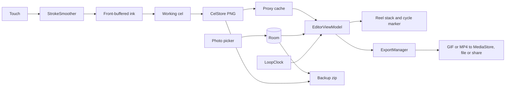

# Mutoscope: every layer loops on its own length

A mutoscope was a penny-arcade reel of cards flipped past a peg by a crank. The app keeps the reel. You draw frame by frame, and every layer is a reel with its own number of frames, so a 4-frame flicker plays over a 12-frame walk and the two drift in and out of phase. Paid Android animators are built on linear timelines and the one free loop-layer app stopped updating in July 2023; Mutoscope is the maintained, one-price animator built on the loop.

## 1. Overview

- **Pitch:** layers that loop independently, a cycle marker showing when they realign, GIF and MP4 with no watermark; complete on install, works in airplane mode.
- **Display name:** Mutoscope. **Play title:** Frame by Frame Loop Animator. **Package:** com.mohdshayan.mutoscope.
- **Category:** Art & Design. **Tagline:** Every layer loops on its own length.
- **Positioning line:** "Loop animation, frame by frame: layers that cycle on their own lengths, onion skin, GIF and MP4 with no watermark. One price, no ads."
- **Price:** USD 4.99, INR 349, paid once.

## 2. Problem and why now

The buyer wants short hand-drawn loops for chat, social or a portfolio. On iPad this is solved and paid: Looom (USD 9.99) is built on independent reels (https://apps.apple.com/us/app/looom/id1454153126) and ToonSquid (USD 9.99, 4.6 from 1.3K ratings) was number 2 on the US top-paid iPad chart when researched (https://apps.apple.com/us/app/toonsquid/id1573778812). Neither is on Android.

On Android the buyer meets FlipaClip first: 50M+ installs, 4.3 from 796K reviews, first for every loop and frame-by-frame phrase in the US and India, free with ads and in-app purchases (https://play.google.com/store/apps/details?id=com.vblast.flipaclip). People who leave it say why in the paid rival's reviews: "never want to go back to flipaclip", "no paid features and no ads" (https://play.google.com/store/apps/details?id=com.weirdhat.roughanimator).

Evidence that people pay upfront now, through search (2026-09-26 live check and judge notes in IDEA.json):

- RoughAnimator, paid with no free twin: USD 7.99 (INR 820), 50K+, 4.5 from 3.55K reviews, about 67 new ratings a month on AndroidRank, price raised from USD 2.99 (2015) to 7.99 (2025).
- It ranks first for "loop animator", second for "loop animation", fourth for "frame by frame animation"; for "loop animator" only three results are real apps.
- New paid entrants, Callipeg at USD 14.99 included, settle at 1K+; niche tools like Stick Nodes Pro (USD 3.99) reach 100K+.

The paid rivals repeat drawings on a linear timeline set up by hand: RoughAnimator's "Make cycle" (https://www.roughanimator.com/userguide-tablet/) and Callipeg's cycles (https://callipeg.com/learn-cycles/). Of the free, ad-free rivals only Mooltik (100K+, 3.7) was found with independent loop layers, last updated July 2023. So a buyer pays because in Mutoscope the loop is the model: a reel's length is its loop, and the marker computes where reels realign and how long the GIF must be. It costs about 60 percent of RoughAnimator in the US and under half in India, with no watermark and nothing locked or ad-funded.

Demand is inferred from paid-result depth and rating velocity; no keyword-volume tool was reachable (market map, Open questions). Expect hundreds to low thousands of lifetime copies.

## 3. Target audience and personas

- **Ishita Rao, 19, animation student, Pune.** Draws on a Redmi between classes, tired of ads. Types **"frame by frame animation"**. Pays on seeing INR 349 against the paid rival's INR 820.
- **Dana Whitcomb, 34, motion designer, Portland.** Makes looping GIFs for team chat and client posts; misses the iPad loop app she used to own. Types **"loop animator"**. Pays at the first screenshot: two reels of different lengths with the cycle marker at frame 12.
- **Valeria Ortiz, 24, illustrator, Guadalajara.** Posts hand-drawn MP4 loops; left an app that watermarked them. Types **"animation app no ads"**. Pays when the listing says no watermark and Data safety says nothing collected.

## 4. Core concept deep-dive

**Reels are the model.** Each reel has its own length, hold (on ones, twos, threes or fours, the animator's vocabulary), phase offset, opacity and visibility; the project has one speed, 4 to 30 fps. At tick `t`, reel `r` shows cel `((t / hold_r) + offset_r) mod length_r`.

**The one memorable thing is the cycle marker.** Under the canvas each reel is a strip of numbered cells repeated to fill the width, so a 4-frame reel visibly repeats against a 12-frame reel like a rhythm grid. One orchid rule crosses every strip where all reels realign, the least common multiple of each `length x hold`, labelled "Cycle: 12 frames" (or 60 for 5 over 12). It answers how long the loop is, and sets GIF length so the file loops with no jump.

**Scrub by dragging** the reel stack; release lands on a whole frame. Tapping a cell selects that reel and frame.

**Finger-first drawing.** One finger draws; two pan, zoom and rotate; two-finger tap undoes, three-finger tap redoes. Once a stylus is seen, fingers only navigate. Brushes ignore pressure.

**It refuses:** accounts, cloud, ads, watermarks, locked tools, pressure claims and kid-styled art.

## 5. Complete feature set

**v1.0, everything USD 4.99 buys:**

1. **Reels:** unlimited, each 1 to 240 frames, with hold, offset, opacity, hide and lock; add, duplicate, reorder and delete reels and frames.
2. **Cycle marker:** LCM of every visible reel's `length x hold`, computed in `Long`, as a rule and label. Past 600 frames the label reads "Cycle: over 600 frames" and GIF export uses the MP4 lengths instead of "One cycle".
3. **Brushes:** Pencil (thin, grain from seeded procedural noise, no texture file), Ink (thinned by speed), Marker (flat, 70 percent opacity, no build-up in a stroke), Eraser; size and opacity remembered.
4. **Low-latency ink:** front-buffered rendering via `androidx.graphics` on Android 10 up, a Compose canvas on 8 and 9; Streamline smoothing 0 to 100.
5. **Fill** with tolerance and "close small gaps" (boundary grown 2 px).
6. **Lasso move:** select, then move or delete.
7. **Palette:** 24 swatches, HSV picker, eyedropper, last eight colours.
8. **Deep undo:** 100 steps covering strokes, fills, lasso, frame and reel edits.
9. **Onion skin:** 0 to 5 ghosts each side fading by distance, red behind and teal ahead (the light-table convention) or orchid or graphite; light-table mode shows other reels at 30 percent.
10. **Playback:** play, drag-to-scrub, 4 to 30 fps, full-screen Preview.
11. **Frames paged to disk** so hundreds of frames run on a low-end phone.
12. **Reference photo** via the photo picker as a locked background reel, excluded from export unless switched on; crash-safe decode.
13. **Export:** GIF (own LZW encoder, paper background) and MP4 (MediaCodec, MediaMuxer) at 512, 720 or 1080 px, no watermark; save or share.
14. **Projects:** thumbnails, rename, duplicate, delete; square, 4:5, 16:9, 9:16; paper colour; `.mutoscope` files and one-file backup and restore.
15. **Sample loop** "Lamp and ball", generated on first run from stroke scripts: a 12-frame bouncing ball over a 4-frame flickering lamp.

**v1.x:** Soft airbrush; transparent GIF; smaller GIFs by frame differencing; lasso flip, scale and rotate; motion prediction via `androidx.input`; single-reel export. **v2:** re-timeable vector layer; camera pans; sprite-sheet export.

**Cut by the wave decision, absent from the listing:** animated WebP (no framework encoder), audio scratch track, symmetry and tile modes, keyboard shortcuts, pressure brushes. Nothing needs a network, so nothing is cut for offline honesty. Soft airbrush, lasso flip and transparent GIF moved to v1.x to fit five weeks.

## 6. Screen-by-screen UX

**Navigation:** one activity, a type-safe `NavHost`: Projects (start), Editor, Preview, Settings. Editor tools live in bottom sheets so the canvas stays in view.

- **Projects:** title, Settings icon, tile grid (two, three or four columns by width) with first frame, name and "Cycle: 12 frames, 3 reels"; one "New loop" button; long-press for Rename, Duplicate, Export project, Delete.
- **New loop sheet:** name ("Loop 1"), four canvas-shape chips drawn as outlines, paper colour, speed (12 fps), "Create loop".
- **Editor, portrait:** top bar (back, name, undo, redo, play, overflow with Preview, Export, Project settings); canvas; reel stack of 48dp rows, four visible, each a name tab and a strip of 44dp cells, the strips scrolling together and following the playhead, the marker crossing all, "Add reel" last; tool bar of six 48dp buttons, Brush (the current brush's glyph; its sheet picks Pencil, Ink or Marker, size and opacity), Eraser, Fill, Lasso, Colour and Onion skin, where tapping the active tool opens its sheet.
- **Editor, landscape and 600dp up:** tools become a leading rail; the reel sheet docks trailing.
- **Reel sheet:** name, length, hold (Ones, Twos, Threes, Fours), offset, opacity, Hide, Lock, Duplicate, Delete. **Frame actions** (long-press a cell): Add frame after, Duplicate, Clear, Delete, Move left, Move right.
- **Project settings:** speed, paper, "Add reference photo", its opacity and "Include in export".
- **Preview:** full-screen playback; tap pauses, drag scrubs.
- **Export sheet:** format, size, length (GIF "One cycle"; MP4 3, 6, 10 or 15 seconds), "Export GIF" or "Export MP4"; progress replaces the body, then "Save to gallery" (or "Save as file") and "Share".
- **Settings:** onion defaults, left-handed rail, "Back up all projects", "Restore from backup", Your numbers, Privacy, Licences.

**Flow 1, first loop in a minute (Dana):** taps "Lamp and ball", which plays one cycle and stops; "New loop", "Create loop"; draws a circle, Add frame after, draws it lower over a red ghost; "Add reel", a two-frame flicker, play; the marker reads "Cycle: 2 frames".

**Flow 2, polyrhythm to GIF (Ishita):** adds a 3-frame reel on Twos to her 8-frame walk; the marker reads "Cycle: 24 frames"; she scrubs to frame 17 and fixes a foot; Export, GIF, 720, "Export GIF"; toast "Exported GIF to Pictures/Mutoscope"; Share.

**Flow 3, trace to MP4 (Valeria):** "Add reference photo", picks her cat, which lands as a locked reel; draws a 6-frame tail wag above it; Export, MP4, 1080, 6 seconds, "Export MP4"; "Save to gallery".

## 7. Design system

**Design read:** Reading this as: a finger-first drawing tool for hobbyist and working animators, with a light-table studio language, leaning toward a width-flexing grotesque over a sturdy sans on the **"light-table grey and electric orchid"** palette family.

Light-table grey and pencil-test graphite; orchid, the icon's hue, is the one colour that is ours, used flat.

**Dials.** Variance 4: a tool must be predictable; asymmetry lives only in the unequal reel strips. Motion 3: motion answers actions; the canvas is the moving thing. Density 6: canvas, strips and tools share a phone screen, so rows are 48dp, but the canvas always gets the most area.

**Colour tokens** (`ui/theme/Color.kt`; contrast measured by script):

| Token | Role | Light | Dark |
|---|---|---|---|
| LightTable | background | #ECEEF3 | #141319 |
| Sheet | sheets, strips, tiles | #F8F9FB | #1F1D26 |
| Graphite | primary text, icons | #1C1D24 | #EAE8F0 |
| Lead | secondary text, control outlines; at 30 percent alpha, hairlines and empty cells | #575B68 | #A19DAE |
| Orchid | the one accent: primary button, active tool, current cell, cycle marker | #9825A7 | #DF8AEA |
| OnOrchid | text on Orchid | #FBF7FD | #1E0A28 |

Contrast, light and dark: Graphite on LightTable 14.5:1 and 15.2:1; Lead on Sheet 6.4:1 and 6.3:1; Orchid on Sheet 6.3:1 and 7.1:1; OnOrchid on Orchid 6.3:1 and 7.9:1. Orchid is hue 293 at 64 percent saturation light, 70 dark, under the 80 percent cap. Canvas-only tokens, never chrome: GhostBefore #C8412C (dark #E8705C), GhostAfter #17857A (dark #4FC7B6), default paper #FCFCFA. No pure black or white.

**Type.** Display: **Anybody** (Google Fonts, SIL OFL 1.1), bundled as `res/font/anybody_variable.ttf` and set through `FontVariation.Settings`: weight 750, width 125 for the Projects title and empty-state headlines; 650 at width 100 for sheet titles. A width-variable face is squash and stretch in type, and the only loud type. Text and numbers: **Public Sans** (Google Fonts, SIL OFL 1.1) at 400, 500, 600; counters, cycle label and fps use `fontFeatureSettings = "tnum"` so digits hold still while scrubbing. Licences to `docs/OFL-Anybody.txt` and `docs/OFL-PublicSans.txt`. Scale 28, 20, 16, 14, 12sp; hierarchy by weight and colour; no all-caps, no monospace.

**Radius scale:** 4dp cells, chips, swatches; 10dp buttons, fields, canvas frame; 20dp sheet tops. The play button is the one circle.

**Icons:** Material Icons Rounded (`material-icons-extended`); five tool glyphs (pencil, nib, marker, lasso, onion skin) as 24dp vectors with a 2dp rounded stroke; every icon button has a `contentDescription`.

**Motion.** One orchestrated first-run moment: the sample's single play-through. Otherwise sheets rise in 220 ms, a new cell grows in 160 ms, the marker slides 200 ms on a length change. Under `LocalReducedMotion` everything snaps and the play-through waits for play.

**States:**
- *Projects:* empty "Your loops live here" with "New loop"; loading, tile outlines in Lead at 30 percent; error "Projects could not be opened. Restore a backup file to get them back." with "Restore from backup"; success "Restored 7 projects".
- *Editor:* empty hint "Draw on frame 1"; loading, canvas outline and empty cells, no spinner; error, a hatched cell and "Frame 9 on Walk could not be read and was replaced with a blank frame."; success, silent autosave.
- *Reference photo:* error "That photo could not be opened. Try a JPEG or PNG under 50 megapixels."; success "Reference photo added".
- *Export:* loading bar with "Frame 31 of 72"; error "MP4 export stopped: this phone's video encoder refused 1080 px." with "Export at 720"; success "Exported MP4".
- *Preview:* empty "Nothing to play yet" with "Back to drawing"; loading, the first frame at proxy size; error, the Editor's hatched cell; success, it plays.
- *Settings:* local prefs, so no empty or loading state; success "Backed up 7 projects"; error "Backup stopped: that location is full or read-only. Pick another folder."

**Access and large screens.** 44dp minimum targets (cells 44 by 48dp); TalkBack reads "Walk, frame 5 of 12, current"; text scales to 200 percent. `--orient unspecified`; ViewModel state survives rotation and folding; tested at 841x701, 1024x640, 1280x800 dp.

**Screenshots:** six 9:16, light first, dark as 5 and 6; loose graphite art with flat fills (ball and lamp, a walking figure of simple shapes), no faces; shot 1 shows reels of 12 and 4, strips scrolled so the marker is on screen; captions in Anybody.

**Icon:** orchid ground #C83CD7 (hue 294) to #AD24BC, inside the decision's 292 to 298 band; a near-white (#FBF4FD) filmstrip ribbon curling into a closed loop with a half twist, one cell Graphite as the current frame; not rings, gear or card fan; 3.8:1 on the lighter stop; nothing like Pigment. This two-stop ground (ICON.md) is the only gradient; UI and feature graphic stay flat.

## 8. Native architecture

```
new-native-app.sh --name "Mutoscope" --pkg com.mohdshayan.mutoscope --perms "" --room --bg "#ECEEF3" --bg-dark "#141319" --orient unspecified
```

No `--glance`, `--work`, `--camerax` or `--media3`: no widget, no scheduled work, no camera or audio.

**Modules:** `:app`, and `:core` (pure Kotlin, JVM-tested) for `loop/LoopClock` (cel index, cycle LCM), `gif/Lzw`, `gif/GifEncoder`, `gif/Quantizer` (octree, one global 256-colour palette across all frames so colours do not flicker), `gif/DelaySchedule` (centisecond delays with carried remainder), `video/Yuv` (ARGB to I420 and NV12), `paint/FloodFill`, `paint/StrokeSmoother` (streamline plus Catmull-Rom), `undo/UndoModel`, `archive/ProjectManifest`, `sample/SampleScripts`, `io/DecodeMath`.

**`:app` packages:** `data/db`, `data/prefs/AppPrefs`, `data/cels/CelStore`, `data/ProjectRepository`, `data/ArchiveRepository`, `export/` (`ExportManager`, `GifWriter`, `Mp4Writer`, `MediaSaver`), `ink/` (`InkSurface`, `Brushes`, `CelCompositor`), and `ui/projects`, `ui/editor`, `ui/preview`, `ui/settings`, each with its ViewModel. `ExportManager` is an application-scoped singleton exposing progress as `StateFlow`, so exports survive rotation.

**Catalog aliases used:** `androidx-core-ktx` (includes `FileProvider`), `androidx-core-splashscreen`, `androidx-lifecycle-runtime-ktx`, `androidx-lifecycle-runtime-compose`, `androidx-lifecycle-viewmodel-compose`, `androidx-activity-compose` (`PickVisualMedia`, `CreateDocument`, `OpenDocument`), `androidx-compose-bom`, `androidx-ui`, `androidx-ui-graphics`, `androidx-ui-tooling`, `androidx-ui-tooling-preview`, `androidx-material3`, `androidx-material-icons-extended`, `androidx-navigation-compose`, `androidx-room-runtime`, `androidx-room-ktx`, `androidx-room-compiler`, `androidx-datastore-preferences`, `kotlinx-coroutines-android`, `kotlinx-serialization-json`, `junit`, `kotlinx-coroutines-test`. **Added:** `androidx-graphics-core` (`androidx.graphics:graphics-core`, version `graphicsCore = "1.0.2"`, or the newest stable 1.0.x if that does not resolve) and `play-review-ktx` (`com.google.android.play:review-ktx`, `playReview = "2.0.2"`).

**Ink.** `InkSurface` is a `SurfaceView` hosted in `AndroidView`. On API 29 up, `CanvasFrontBufferedRenderer` draws each `ACTION_MOVE` segment (with historical points) to the front buffer; `ACTION_UP` rasterises the stroke into the working cel through the multi-buffered layer. API 26 to 28 draw into the cel and invalidate a Compose `Canvas`. Composite: paper, reference, other reels, tinted ghosts, working cel.

**Memory.** Cels are lossless PNG at 1080 px long edge in `filesDir/projects/<id>/cels/`, written 600 ms after the last stroke and on pause. An `LruCache` of half-size proxies (a quarter of `memoryClass`) feeds playback and ghosts; only the working cel is full size. Undo patches go to `cacheDir/undo/`.

**Import, the must-not-crash path.** `PickVisualMedia(ImageOnly)`, then decode on `Dispatchers.IO` inside `runCatching`: `ImageDecoder` with `setTargetSize` on API 28 up; bounds pass, `inSampleSize` from `DecodeMath` and EXIF rotation on 26 and 27. Over 50 megapixels is refused; any exception, `OutOfMemoryError` included, shows the error and leaves the project untouched.

**Export.** GIF: global palette, LZW to 12-bit codes, Netscape loop block. MP4: `video/avc` with `COLOR_FormatYUV420Flexible` images filled by `Yuv`, 2, 4 or 8 Mbps by size, a key frame each second, timestamps `tick * 1_000_000 / fps`, both sides rounded to even, size checked with `isSizeSupported` and dropped to a multiple of 16 if refused. API 29 up saves into `MediaStore` (Pictures or Movies, subfolder Mutoscope) with `IS_PENDING`, deleting stale pending rows on launch; API 26 to 28 save through `CreateDocument`. Share via `FileProvider`.

**Permissions: none.** The photo picker needs no media permission, `MediaStore` on Android 10 up needs no storage permission (older versions use the file picker), and `performHapticFeedback` needs no VIBRATE. INTERNET is absent; `review-ktx` works through the Play Store app.

**Sensors and hardware:** none beyond touch; `MotionEvent.getToolType` tells stylus from finger. **Bundled assets:** `anybody_variable.ttf` (about 0.3 MB) and Public Sans 400, 500, 600 (about 0.2 MB together), both SIL OFL 1.1; Material Icons, Apache 2.0. The sample and brush grain are generated in code, so no images or models ship.

**Background work, widgets, tiles:** none. Export runs in the app process.



## 9. Data model

**Room** (`version = 1` until shipped):
- `ProjectEntity`: `id: Long` PK, `name: String`, `aspect: String` (SQUARE, PORTRAIT_4_5, LANDSCAPE_16_9, VERTICAL_9_16), `widthPx: Int`, `heightPx: Int`, `fps: Int`, `paperArgb: Int`, `thumbnailPath: String?`, `isSample: Boolean`, `createdAt: Long`, `updatedAt: Long`.
- `ReelEntity`: `id: Long` PK, `projectId: Long` FK cascade indexed, `name: String`, `zIndex: Int`, `hold: Int`, `phaseOffset: Int` (not `offset`, an SQL keyword), `opacity: Float`, `hidden: Boolean`, `locked: Boolean`, `kind: String` (DRAWN, REFERENCE), `includeInExport: Boolean`.
- `CelEntity`: `id: Long` PK, `reelId: Long` FK cascade indexed, `position: Int`, `filePath: String?` (null is blank), `updatedAt: Long`. Reel length is its cel count.

**DataStore keys:** `samplePlayed`, `onionBefore` (2), `onionAfter` (1), `onionTint`, `onionOpacity`, `lightTable`, `streamline` (40), `lastTool`, `brushSizes`, `brushOpacity`, `recentColours`, `leftHanded`, `defaultFps` (12), `exportFormat`, `exportSize`, `successfulExports`, `reviewAsked`, `countsOptIn`, `countMultiReelCycles`, `countDrawingDays` (last 30 dates, JSON).

**Export and import.** A project travels as `<name>.mutoscope`: a zip of `project.json` (`ProjectManifest`, format version 1) plus `cels/<reel>-<frame>.png` and `reference.png`. "Back up all projects" writes `mutoscope-backup-<yyyy-MM-dd>.zip` holding one `.mutoscope` per project through `CreateDocument`; restore and import use `OpenDocument` (`application/zip`, `application/octet-stream`), add projects without overwriting, and report the count. Finished loops leave as GIF or MP4 through the share sheet.

## 10. Pricing and countries

**USD 4.99, INR 349**, set to Paid before the first release, on the ladder's "Professional or privacy tool" rung (USD 4.99 / INR 249), whose buyers displace incumbents at USD 7.99 and up. India is INR 349 by the wave decision, not the rung's 249: the ladder tolerates INR 249 to 349 for professional-grade tools, and the paid rivals list at INR 820 and 1,499. Brazil, Indonesia, Turkey and Mexico are hand-set near 40 percent of converted USD; the rest take Play's conversion.

**Launch:** no launch discount; a 20 percent sale (USD 3.99, INR 279) for seven days in week two, never USD 0. **Refunds:** Play's standard 48-hour refund request window, no extra promise; the sample loop lands the value inside it.

**Why this niche pays:** animators pay once for a tool that stays out of the way; RoughAnimator raised its price for ten years and kept growing. USD 4.99 sits below every serious paid rival and above the disposable tier.

## 11. Play Store listing

- **Title (28 of 30):** `Frame by Frame Loop Animator`
- **Short description (77 of 80):** `Loop animation, frame by frame. One price, no ads, no account, works offline.`
- **Full description (1,218 of 4,000):**

```
Draw loop animation frame by frame, where every layer loops on its own length. Put a 4-frame flicker over a 12-frame walk and watch them cycle together.
Export clean GIF and MP4 with no watermark. One price buys every feature: no ads, no in-app purchases, no account.
Each layer is a reel with its own frame count, timing and offset, and the cycle marker shows where they all line up again.

Reels and timing
- Unlimited reels, each with its own number of frames and timing
- Onion skin: up to 5 frames before and after, with adjustable tint
- Drag the reels to scrub; play from 4 to 30 frames per second

Drawing
- Pencil, ink, marker, eraser, fill and lasso move
- Low-latency ink with adjustable stroke smoothing
- 100 steps of undo, with two-finger tap to undo
- Trace over a photo on a locked background layer

Export
- GIF that loops forever, or MP4, at 512, 720 or 1080 pixels
- No watermark on anything you make
- Save to your gallery or share

Your work stays on your phone
- No cloud, no sign-in, no permissions requested
- Back up every project to one file and restore it on another phone

Made for phones, tablets and foldables.

One-time purchase. No ads, no subscription, no account. Works fully offline.
```

- **Keywords:** loop animation, loop animator, frame by frame animation, flipbook animation, 2d animation offline, animation no ads, onion skin, gif maker drawing.
- **Screenshot captions:** 1 "Every layer loops on its own length" (reels of 12 and 4, marker visible); 2 "Onion skin shows the frames around you"; 3 "Pencil, ink, marker, fill and lasso"; 4 "Export GIF or MP4 with no watermark"; 5 "Hold on twos, shift the phase" (dark, reel sheet); 6 "No account. Back up everything to one file" (dark, Projects).
- **Feature graphic (1024x500):** flat orchid #C83CD7, the mark large at left, "Mutoscope" in Anybody 750 width 125 in #FBF4FD, and "Draw loops frame by frame, each layer on its own length" (55 characters). No price or badges.
- **Category:** Art & Design. **Content rating:** IARC as a drawing tool with no violence or user-to-user sharing; expected Everyone, PEGI 3. **Target age:** 13 to 15, 16 to 17, 18 and over; no under-13 group.
- **Stated plainly:** paid, no ads, no in-app purchases, works offline.

## 12. Policy and data safety

**Data safety:** collected none, shared none, no network use; the picked photo never leaves the device. **Privacy policy:** `docs/privacy-policy.html`, generated from the empty permission list, hosted before the form and linked from Settings. **Sensitive permission forms:** none. **Health or financial declarations:** not applicable. **Families:** avoided by a 13-plus target age and no characters or child-directed copy. **Ads:** none. **App access:** no login.

**The listing must not claim or contain:** pressure sensitivity, WebP, sound, airbrush, transparent GIF, symmetry, keyboard shortcuts, "the only", "the first", "free", "best", chart or install numbers, or the names Looom, ToonSquid, FlipaClip, RoughAnimator and Callipeg.

## 13. Organic growth

"Frame by frame" in the title targets the broad query, "loop animator" the thin one where an exact-phrase title can reach page one. The short description carries "loop animation"; the first two description lines add "layer", "GIF" and "MP4"; "onion skin" and "no ads" appear lower down. At launch, a 30-second recording of the two-reel polyrhythm goes to two or three animation subreddits as a plain developer post, plus short emails to a few small animation YouTubers.

**Review prompt:** `ReviewManager` once, after the third successful export, never on first launch.

**Not done:** paid acquisition, incentivised or fake reviews, a free twin, competitor names.

## 14. KPIs

Local-only, opt-in counts ("Keep simple counts on this phone", off by default), shown in Settings and never sent anywhere:

1. **Multi-reel cycles:** projects with reels of different lengths; if unused, the pitch missed.
2. **Successful exports:** a finished loop is the job.
3. **Drawing days in the last 30:** animators return to a tool they trust.

Play Console, weekly: refund rate under 10 percent, crash rate far under 1.09 percent, and ANR rate watched on export. If multi-reel cycles stay rare while exports are healthy, the listing is selling a plain animator and the first screenshot changes.

## 15. Risks and mitigations

- **Refund window:** the sample plays on open, a new loop is one tap, onion skin is on by default, and the first export needs no settings.
- **FlipaClip, the free incumbent:** do not fight on breadth; lead with independent reels, the marker, no ads and no watermark in the first lines and screenshot.
- **Hardest subsystem, ink feel:** front-buffered rendering, historical points, tunable smoothing, a full week and low-end testing.
- **Encoders across devices:** `isSizeSupported`, 16-alignment fallback, one-tap retry at 720; GIF is pure tested Kotlin.
- **Memory on long projects:** cels and undo paged to disk, bounded proxies, a 240-frame reel cap.
- **Import crashes** (RoughAnimator's named complaint): bounded decode, size refusal, `runCatching`, tested sample-size maths.
- **Families review, Pigment confusion:** general-audience art, 13-plus age, an unrelated icon.

## 16. Competitive landscape

From the 2026-09-26 live check.

| App | Price | Installs | Rating | Updated | Why Mutoscope instead |
|---|---|---|---|---|---|
| FlipaClip | Free, ads, IAP | 50M+ | 4.3 | Sep 14 2026 | No ads, nothing locked, independent reel lengths. |
| RoughAnimator | USD 7.99, INR 820 | 50K+ | 4.5 | Aug 25 2026 | Its "Make cycle" repeats drawings on a timeline set up by hand; here each reel is the loop, with a cycle marker, at under half its India price. |
| Callipeg | USD 14.99, INR 1,499 | 1K+ | 4.2 | Sep 12 2026 | Has timeline cycles too; a third of the price, and loop length is the reel itself. |
| Mooltik | Free, no ads | 100K+ | 3.7 | Jul 2023 | Same loop idea, maintained, with GIF and MP4 export. |
| Draw animation Anim creator | Free, no ads | 100K+ | 3.8 | Aug 28 2026 | Independent reel lengths and clean exports. |
| Stick Nodes Pro | USD 3.99, INR 380 | 100K+ | 4.8 | Sep 4 2026 | Draw anything, not only stick figures. |

## 17. Development plan

Five weeks, solo.

- **Week 1:** generate, key, `:core`; `LoopClock`, `ProjectManifest`, Room, `CelStore` paging; Projects; Editor shell with reel stack, marker, reel sheet and frame actions on real data.
- **Week 2, ink only:** `InkSurface` and its fallback, three brushes and eraser, `StrokeSmoother`, gestures, stylus handling, `UndoModel`; tuned on a low-end phone.
- **Week 3:** fill, lasso, colour sheet, onion skin, scrub, playback, Preview, reference import.
- **Week 4:** `Quantizer`, `Lzw`, `GifEncoder`, `DelaySchedule`, `Yuv`, `Mp4Writer`, `ExportManager`, `MediaSaver`, share, `.mutoscope` files, backup and restore.
- **Week 5:** sample and first-run play-through, large screens, states, TalkBack, reduced motion, dark pass, fonts, review prompt, store assets, privacy policy, README, preflight.

**Cut if behind, in order:** review prompt, HSV picker (swatches, eyedropper and recents stay), landscape rail, per-reel offset. Never cut anything on the MUST list in `IDEA.json` (`wave3_decision`).

**JVM tests (`:core`):** `LoopClock` holds, offsets and cycles (4 and 12, 5 and 12, the 600-frame cap without overflow); `Lzw` round trip; `GifEncoder` header and loop bytes; `DelaySchedule` totals at 30 fps; `Quantizer` caps at 256; `Yuv` pure colours; `FloodFill` gap closing; `StrokeSmoother` spacing; `UndoModel` truncation at 100; `DecodeMath` for 12000 x 9000; `ProjectManifest` round trip.

**Emulator smoke:** sample plays once; add a reel of another length and check the marker; scrub; import a huge photo and a corrupt file; export GIF 1080 and MP4 720, save, share; back up, delete all, restore; kill and relaunch; rotate mid-export; dark mode; 200 percent font; a 200-frame project scrubs without running out of memory.

**Preflight:** `build.sh mutoscope` prints `CN=SocialSure Private Limited` with tests green; `verify.sh` has no FAIL; zero permissions and no INTERNET in the merged manifest; SDK 36; R8 release runs both exports; privacy URL returns 200; Data safety empty; rating and target age submitted; Paid at USD 4.99 and INR 349 before release; listing counts match section 11; no em or en dash anywhere.
